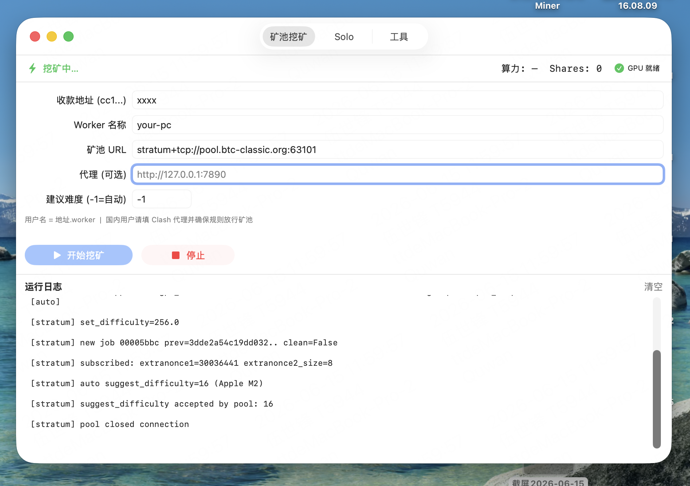
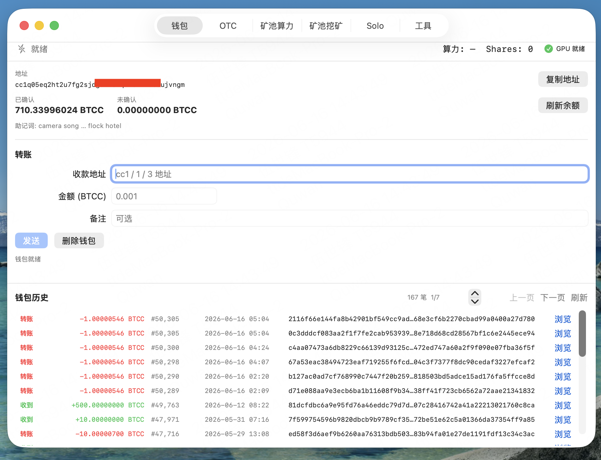
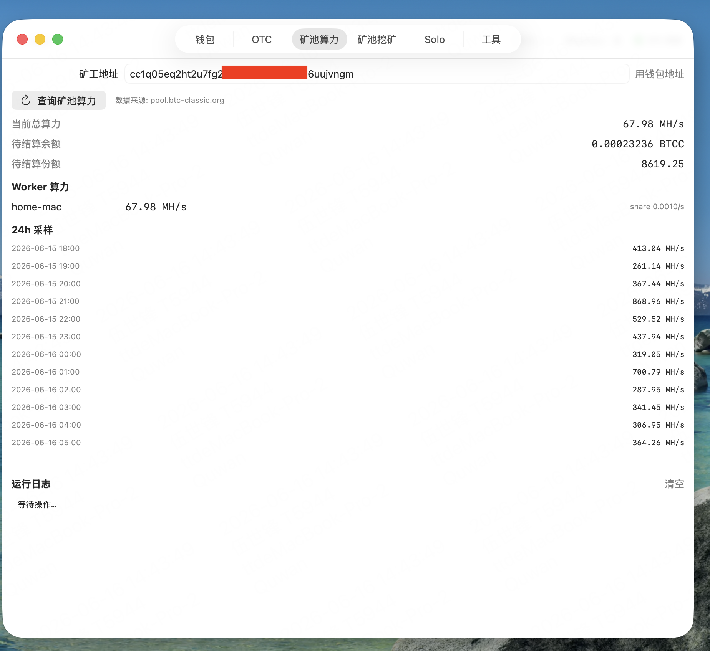
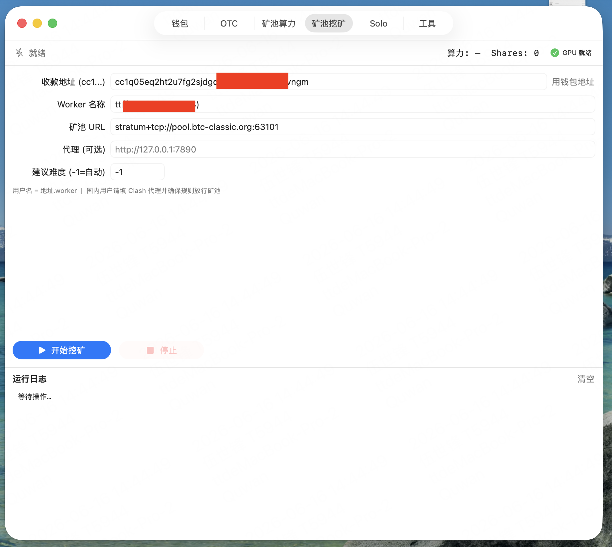
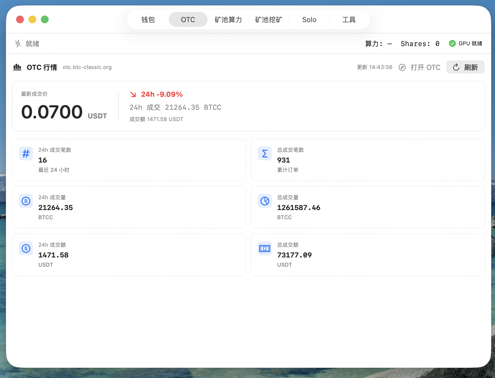

# BTCC Wallet (Electron / macOS)

Bitcoin Classic (BTCC) **一体化桌面客户端**：助记词钱包、转账、链上历史、OTC 行情、矿池算力查询和 Apple Silicon GPU 挖矿。当前主线已重构为 **Electron + Node.js**，便于后续扩展多客户端；旧 SwiftUI 实现仍保留在 `gui/native/` 作为对照。

> 本项目由 [BTCC_apple-gpu-miner](https://github.com/wendell1224/BTCC_apple-gpu-miner) 的 GUI 整合而来，定位为 **钱包优先** 的 all-in-one 产品。



## 功能一览

| 模块 | 说明 |
|------|------|
| **钱包** | BIP39 创建/导入助记词、cc1 地址、余额查询、BTCC 转账；助记词使用用户钱包密码加密保存，不访问本地钥匙串 |
| **转账** | 支持 Native SegWit、Taproot、Legacy、P2SH 地址；支持备注；广播后展示 TXID 和区块浏览器链接 |
| **交易历史** | 使用区块浏览器分页接口加载钱包历史，展示转账/收到/自转账、金额、区块高度、时间和浏览器链接 |
| **OTC** | 展示 OTC 最新价格、24h 涨跌、成交量、成交额和累计交易数据 |
| **矿池算力** | 查询 pool.btc-classic.org 矿工算力、待结算余额、Worker 24h 采样和当前算力排行榜 |
| **矿池挖矿** | Stratum v1 GPU 挖矿，支持 SOCKS5/HTTP 代理和低功耗在线模式 |
| **Solo** | 连本地 bitcoind/btccd 节点 Solo 挖，支持低功耗在线模式 |
| **工具** | 编译 Metal Helper、GPU 冒烟测试、代理测试 |

## 系统要求

- macOS 12+，Apple Silicon (M1/M2/M3/M4)
- Xcode Command Line Tools：`xcode-select --install`
- Python 3.9+（标准库，钱包与挖矿子进程）


## 出现提示'已损坏，无法打开。 您应该将它移到废纸篓'
在终端运行：
```
sudo xattr -cr /Applications/BTCC\ Apple\ GPU\ Miner.app
```
输入密码(密码不会显示)然后回车即可

## 快速开始

### Electron 开发运行

```bash
npm install --cache .npm-cache
./scripts/start_electron.sh
```

测试和验证：

```bash
npm run test:node                  # Node 钱包/交易/矿工核心单测
npm run smoke:electron             # Electron 窗口 + preload 冒烟验证
python3 -m unittest discover -s tests -p 'test_*.py'  # 旧 Python 核心回归
```

打包 Electron `.app`：

```bash
./scripts/build_electron.sh --dir   # → dist/electron/mac-arm64/BTCC Wallet.app
./scripts/build_electron.sh         # → Electron DMG/ZIP
```

### 旧 SwiftUI 构建

```bash
./scripts/build_dmg.sh
# → dist/BTCC Wallet.app
# → dist/BTCC-Wallet-v1.0.0.dmg
```

打开 DMG → 拖到「应用程序」→ 从启动台打开（不要直接从 DMG 卷运行）。

如果只需要生成 `.app`，不生成 DMG：

```bash
./scripts/build_dmg.sh --app-only --skip-metal
# → dist/BTCC Wallet.app
```

> 当前默认使用 ad-hoc 签名。若 macOS Gatekeeper 拦截启动，需要使用 Apple Developer ID 签名并 notarize，或在本机安全设置中手动允许。

### 旧 SwiftUI 本地运行

```bash
git clone <本仓库>
cd BTCC_all_in_one_wallet_mac

./scripts/build_metal.sh          # 首次编译 GPU helper
./scripts/start_gui.sh            # 启动 SwiftUI 应用
```

## 钱包



1. 打开 **「钱包」** 标签 → **创建新钱包** 或 **导入助记词**
2. 创建后请务必备份 12 词助记词。Electron 版保存在 `~/Library/Application Support/BTCCWallet/wallet.enc.json`，内容使用用户设置的钱包密码经 `scrypt` 派生密钥并用 `AES-256-GCM` 加密；不调用 macOS Keychain / 本地钥匙串。检测到旧明文 `wallet.json` 时，输入钱包密码后会迁移为加密文件并删除旧文件。
3. 地址路径：`m/84'/0'/0'/0/0`，生成 `cc1...` 收款地址
4. **转账**：填收款地址、BTCC 金额和可选备注 → 发送（自动选 UTXO、签名、广播）
5. 转账成功后会展示 TXID，并提供 [explorer.btc-classic.org](https://explorer.btc-classic.org/) 区块浏览器链接
6. 钱包底部会分页展示历史交易，包含动作、金额、区块高度、时间和浏览器入口

支持的收款地址类型：

- Native SegWit：`cc1q...`
- Taproot：`cc1p...`
- Legacy：`1...`
- P2SH：`3...`

数据接口：

- [api.btc-classic.org](https://api.btc-classic.org)：余额 / UTXO / 广播
- [explorer.btc-classic.org](https://explorer.btc-classic.org/)：交易历史 / 区块浏览器

## 矿池算力


在 **「矿池算力」** 标签填入矿工地址（`cc1...`，不含 worker 后缀），点击 **查询矿池算力**。

接口：`pool.btc-classic.org/api/pplns/pools/btcc-pplns/miners/{地址}?perfMode=Day`

页面同时展示当前 Solo 算力排行榜，列出矿工排名、完整地址、Worker 数、1h/1d/7d 算力和 Best Share。

排行榜接口：`pool.btc-classic.org/api/solo/top/hashrates`

## GPU 挖矿


默认矿池：`stratum+tcp://pool.btc-classic.org:63101`，地址须 `cc1...` 前缀。

M 系列实测 ~180 MH/s，零调参。详见原矿工项目文档。

如果只需要保持矿机在线而不释放全部性能，可以打开 **低功耗在线**，设置 5%-100% 的 GPU 平均占用。应用会以短 GPU 批次 + 批次间休眠的方式降低平均算力和功耗，同时保持矿池连接。

## OTC 信息



在 **「OTC」** 标签可以查看当前 OTC 市场概览：

- 最新成交价和计价币种
- 24h 涨跌幅
- 24h 成交笔数、成交量、成交额
- 累计成交笔数、成交量、成交额

接口：`https://otc.btc-classic.org/otc/api/stats/overview`

## 项目结构

```
BTCC_all_in_one_wallet_mac/
├── electron/                # Electron + Node.js 应用
│   ├── lib/                 # Node 钱包、交易、API、矿工、安全存储逻辑
│   ├── main.js              # Electron 主进程 + IPC
│   ├── preload.cjs          # 渲染进程白名单 API
│   └── renderer/            # UI
├── gui/native/              # 旧 SwiftUI 应用 (BTCCWalletApp)
├── src/
│   ├── wallet/              # BIP39/BIP32/bech32/交易签名
│   ├── wallet_tool.py       # 钱包 CLI（GUI 子进程调用）
│   ├── stratum_miner.py     # Stratum 矿池客户端
│   └── metal_nonce_finder   # Metal GPU helper（编译产物）
├── scripts/
│   ├── start_gui.sh         # 开发启动
│   ├── build_dmg.sh         # 打包 .app + DMG
│   └── release.sh           # 发布 GitHub Release
├── docs/GUI.png             # 界面截图
└── VERSION                  # 版本号
```

应用数据目录：`~/Library/Application Support/BTCCWallet/`

Electron 钱包文件：`wallet.enc.json`（用户密码 + `scrypt` + `AES-256-GCM` 密文，不访问本地钥匙串）。旧 SwiftUI 明文 `wallet.json` 会在用户输入密码迁移后删除。

## 发布

```bash
# 改 VERSION + docs/releases/vX.Y.Z.md
./scripts/release.sh --build-only   # 本地试打包
git tag v1.0.0 && git push origin main --tags
./scripts/release.sh                # 或 push tag 触发 GitHub Actions
```

输出：`dist/BTCC-Wallet-v<版本>.dmg`

## 与 BTCC_apple-gpu-miner 的关系

| | BTCC_apple-gpu-miner | BTCC_all_in_one_wallet_mac |
|---|---|---|
| 定位 | GPU 挖矿工具 + GUI | **一体化 BTCC 钱包**（含挖矿） |
| 应用名 | BTCC Apple GPU Miner | **BTCC Wallet** |
| 默认 Tab | 矿池挖矿 | **钱包** |
| Bundle ID | org.btc-classic.apple-gpu-miner | org.btc-classic.wallet |

两个仓库可独立演进；新功能建议优先在本仓库开发。

## License

MIT — 见 [LICENSE](LICENSE)
